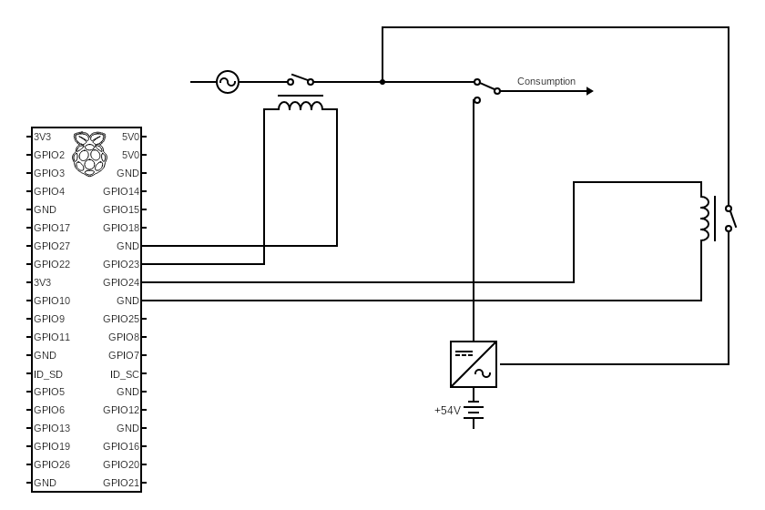

# Smart Power Source Switch (RPi)
A Python-based automated power source switch for Raspberry Pi. This script dynamically switches between grid power and a secondary source based on time settings:

- Grid Power: Active between 11 PM – 7 AM (nighttime).
- Secondary Source: Used during the day for efficiency.
- Debounce Mechanism: Prevents unnecessary switching if toggled too quickly.
- Future Plans:
  - IPC via named pipes (FIFO) for web API integration to manually operate switching;
  - Add CAN/RS485 shield to read secondary source information.

## Circuit

